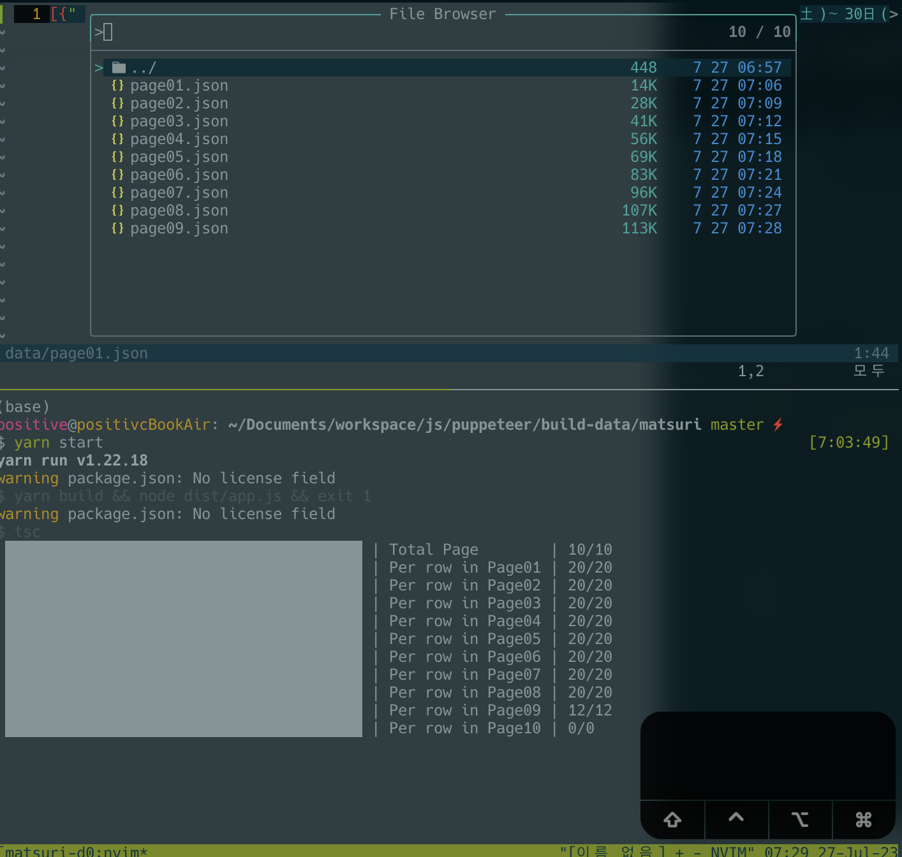

# 祭りデータ取得

## demo


## 取得結果


#### データが被ってる。。；；
``` json
[
  {
    "開催場所": "不忍池周辺",
    "料金": "こちらよりご確認ください",
    "開催日": "2023年7月15日(土)～30日(日)令和5年度は、縁日や盆踊り（日程は後日発表、7月上旬頃の決定を予定）を開催。イベントにより開催日時が異なるため、確認しての来場を。",
    "電話番号（メイン）": "03-3833-0020上野観光連盟",
    "住所": "台東区",
    "交通アクセス": "[公共交通]JR上野駅より徒歩約5分",
    "駐車場": "なし。",
    "カテゴリ": "祭りフェスティバル・パレード子供と恋人と・夫婦で",
    "公式サイト": "公式サイトほか、関連サイトはこちら"
  },
  {
    "開催場所": "不忍池周辺",
    "料金": "こちらよりご確認ください",
    "開催日": "2023年7月15日(土)～30日(日)令和5年度は、縁日や盆踊り（日程は後日発表、7月上旬頃の決定を予定）を開催。イベントにより開催日時が異なるため、確認しての来場を。",
    "電話番号（メイン）": "03-3833-0020上野観光連盟",
    "住所": "台東区",
    "交通アクセス": "[公共交通]JR上野駅より徒歩約5分",
    "駐車場": "なし。",
    "カテゴリ": "祭りフェスティバル・パレード子供と恋人と・夫婦で",
    "公式サイト": "公式サイトほか、関連サイトはこちら"
  },
  {
    "開催場所": "神楽坂通り(早稲田通り)周辺",
    "開催日": "2023年7月26日(水)～29日(土)7月26日(水)・27日(木)は「ほおずき市」、7月28日(金)・29日(土)は「阿波踊り大会」の2部構成※屋台は7月26日(水)・27日(木)のみ",
    "開催時間": "7月26日(水)・27日(木)17:00～21:00、7月28日(金)19:00～21:00、29日(土)18:00～21:00",
    "予約": "予約不要不要",
    "電話番号（メイン）": "050-5541-8600ハローダイヤル(7月1日～7月30日)",
    "住所": "東京都新宿区神楽坂1丁目～6丁目周辺",
    "交通アクセス": "【電車】JR・地下鉄飯田橋駅から徒歩3分",
    "駐車場": "なし。会場周辺は駐車場なし、公共交通機関の利用を推奨",
    "カテゴリ": "祭り",
    "公式サイト": "公式サイトほか、関連サイトはこちら",
    "荒天の場合": "小雨決行、荒天時は中止(詳細は公式サイトにて)",
    "年齢制限": "子供縁日は中学生以下が対象",
    "駅近（最寄り駅から徒歩10分以内）": "◯"
  },
  {
    "開催場所": "神楽坂通り(早稲田通り)周辺",
    "開催日": "2023年7月26日(水)～29日(土)7月26日(水)・27日(木)は「ほおずき市」、7月28日(金)・29日(土)は「阿波踊り大会」の2部構成※屋台は7月26日(水)・27日(木)のみ",
    "開催時間": "7月26日(水)・27日(木)17:00～21:00、7月28日(金)19:00～21:00、29日(土)18:00～21:00",
    "予約": "予約不要不要",
    "電話番号（メイン）": "050-5541-8600ハローダイヤル(7月1日～7月30日)",
    "住所": "東京都新宿区神楽坂1丁目～6丁目周辺",
    "交通アクセス": "【電車】JR・地下鉄飯田橋駅から徒歩3分",
    "駐車場": "なし。会場周辺は駐車場なし、公共交通機関の利用を推奨",
    "カテゴリ": "祭り",
    "公式サイト": "公式サイトほか、関連サイトはこちら",
    "荒天の場合": "小雨決行、荒天時は中止(詳細は公式サイトにて)",
    "年齢制限": "子供縁日は中学生以下が対象",
    "駅近（最寄り駅から徒歩10分以内）": "◯"
  },
  {
    "開催場所": "上野恩賜公園不忍池畔",
    "料金": "こちらよりご確認ください",
    "開催日": "2023年7月15日(土)～30日(日)",
    "開催時間": "イベントにより異なる",
    "予約": "予約不要",
    "電話番号（メイン）": "03-3833-0030上野観光連盟",
    "住所": "東京都台東区",
    "交通アクセス": "【電車】JR・東京メトロ上野駅からすぐ【車】首都高速道路1号上野線上野出入口から約4分、入谷出入口から約5分",
    "駐車場": "なし。",
    "カテゴリ": "祭り",
    "公式サイト": "公式サイトほか、関連サイトはこちら",
    "荒天の場合": "当日の状況により中止の場合あり",
    "駅近（最寄り駅から徒歩10分以内）": "◯"
  },
  {
    "開催場所": "上野恩賜公園不忍池畔",
    "料金": "こちらよりご確認ください",
    "開催日": "2023年7月15日(土)～30日(日)",
    "開催時間": "イベントにより異なる",
    "予約": "予約不要",
    "電話番号（メイン）": "03-3833-0030上野観光連盟",
    "住所": "東京都台東区",
    "交通アクセス": "【電車】JR・東京メトロ上野駅からすぐ【車】首都高速道路1号上野線上野出入口から約4分、入谷出入口から約5分",
    "駐車場": "なし。",
    "カテゴリ": "祭り",
    "公式サイト": "公式サイトほか、関連サイトはこちら",
    "荒天の場合": "当日の状況により中止の場合あり",
    "駅近（最寄り駅から徒歩10分以内）": "◯"
  },
  {
    "開催場所": "東京スカイツリータウン(R)1Fソラマチひろば、ソラマチ商店街ほか",
    "開催日": "2023年7月29日(土)～8月3日(木)墨田区民納涼民踊大会は8月1日(火)～3日(木)",
    "開催時間": "墨田区民納涼民踊大会は18:00～20:00(予定)",
    "予約": "予約不要",
    "電話番号（メイン）": "0570-55-0102東京ソラマチコールセンター10:00～21:00",
    "住所": "東京都墨田区押上1-1-2",
    "交通アクセス": "【電車】東武スカイツリーラインとうきょうスカイツリー駅または東京メトロ押上(スカイツリー前)駅から徒歩すぐ【車】首都高速6号向島線駒形出口から約10分",
    "駐車場": "1000台350円/30分各店で買物金額の合計が3000円以上で60分、5000円以上で120分無料、7000円以上で180分無料。一部除外店舗あり。利用時間7:30～23:00、入庫は22:00まで",
    "カテゴリ": "祭り市・縁日",
    "公式サイト": "公式サイトほか、関連サイトはこちら",
    "荒天の場合": "雨天、荒天時は予告なく内容の変更や中止となる場合あり",
    "駅近（最寄り駅から徒歩10分以内）": "◯"
  },
  {
    "開催場所": "東京スカイツリータウン(R)1Fソラマチひろば、ソラマチ商店街ほか",
    "開催日": "2023年7月29日(土)～8月3日(木)墨田区民納涼民踊大会は8月1日(火)～3日(木)",
    "開催時間": "墨田区民納涼民踊大会は18:00～20:00(予定)",
    "予約": "予約不要",
    "電話番号（メイン）": "0570-55-0102東京ソラマチコールセンター10:00～21:00",
    "住所": "東京都墨田区押上1-1-2",
    "交通アクセス": "【電車】東武スカイツリーラインとうきょうスカイツリー駅または東京メトロ押上(スカイツリー前)駅から徒歩すぐ【車】首都高速6号向島線駒形出口から約10分",
    "駐車場": "1000台350円/30分各店で買物金額の合計が3000円以上で60分、5000円以上で120分無料、7000円以上で180分無料。一部除外店舗あり。利用時間7:30～23:00、入庫は22:00まで",
    "カテゴリ": "祭り市・縁日",
    "公式サイト": "公式サイトほか、関連サイトはこちら",
    "荒天の場合": "雨天、荒天時は予告なく内容の変更や中止となる場合あり",
    "駅近（最寄り駅から徒歩10分以内）": "◯"
  },
  {
    "開催場所": "羽田神社",
    "開催日": "2023年7月28日(金)～30日(日)",
    "開催時間": "7月28日(金)19:00本社大神輿神霊入れ式、29日(土)9:00例大祭式、10:00御旅所清祓式、30日(日)8:00〜12:00頃本社大神輿羽田全町渡御、15:00〜18:00町内神輿連合渡御",
    "予約": "予約不要",
    "電話番号（メイン）": "03-3741-0023",
    "住所": "東京都大田区本羽田3-9-12",
    "交通アクセス": "【電車】京急電鉄大鳥居駅から徒歩10分",
    "駐車場": "なし。",
    "カテゴリ": "祭り",
    "公式サイト": "公式サイトほか、関連サイトはこちら",
    "荒天の場合": "全日程雨天決行※荒天時は開催中止の場合あり",
    "駅近（最寄り駅から徒歩10分以内）": "◯"
  },
  {
    "開催場所": "羽田神社",
    "開催日": "2023年7月28日(金)～30日(日)",
    "開催時間": "7月28日(金)19:00本社大神輿神霊入れ式、29日(土)9:00例大祭式、10:00御旅所清祓式、30日(日)8:00〜12:00頃本社大神輿羽田全町渡御、15:00〜18:00町内神輿連合渡御",
    "予約": "予約不要",
    "電話番号（メイン）": "03-3741-0023",
    "住所": "東京都大田区本羽田3-9-12",
    "交通アクセス": "【電車】京急電鉄大鳥居駅から徒歩10分",
    "駐車場": "なし。",
    "カテゴリ": "祭り",
    "公式サイト": "公式サイトほか、関連サイトはこちら",
    "荒天の場合": "全日程雨天決行※荒天時は開催中止の場合あり",
    "駅近（最寄り駅から徒歩10分以内）": "◯"
  },
  {
    "開催場所": "鶴岡八幡宮",
    "開催日": "2023年8月7日(月)～9日(水)",
    "開催時間": "9:00～21:00",
    "予約": "予約不要",
    "電話番号（メイン）": "0467-22-0315",
    "住所": "神奈川県鎌倉市雪ノ下2-1-31",
    "交通アクセス": "【電車】JR・江ノ島電鉄鎌倉駅から徒歩10分",
    "駐車場": "40台600円/1時間公共交通機関を利用",
    "カテゴリ": "祭り",
    "公式サイト": "公式サイトほか、関連サイトはこちら",
    "荒天の場合": "開催中止",
    "駅近（最寄り駅から徒歩10分以内）": "◯"
  },
  {
    "開催場所": "鶴岡八幡宮",
    "開催日": "2023年8月7日(月)～9日(水)",
    "開催時間": "9:00～21:00",
    "予約": "予約不要",
    "電話番号（メイン）": "0467-22-0315",
    "住所": "神奈川県鎌倉市雪ノ下2-1-31",
    "交通アクセス": "【電車】JR・江ノ島電鉄鎌倉駅から徒歩10分",
    "駐車場": "40台600円/1時間公共交通機関を利用",
    "カテゴリ": "祭り",
    "公式サイト": "公式サイトほか、関連サイトはこちら",
    "荒天の場合": "開催中止",
    "駅近（最寄り駅から徒歩10分以内）": "◯"
  },
  {
    "開催場所": "つがの里",
    "開催日": "2023年6月1日(木)～7月31日(月)イベント開催日時は6/17（土）、6/18（日）、6/24（土）、6/25（日）午前6時～午前11時。",
    "電話番号（メイン）": "0282-92-0008つがの里ふるさとセンター",
    "住所": "栃木市都賀町臼久保325",
    "交通アクセス": "[車]東北自動車道「栃木」ICから約15分／北関東自動車道「都賀」ICから約10分[公共交通]東武日光線「家中駅」より徒歩約45分",
    "駐車場": "550台",
    "カテゴリ": "祭り体験イベント・アクティビティ子供と恋人と・夫婦で",
    "公式サイト": "公式サイトほか、関連サイトはこちら"
  },
  {
    "開催場所": "つがの里",
    "開催日": "2023年6月1日(木)～7月31日(月)イベント開催日時は6/17（土）、6/18（日）、6/24（土）、6/25（日）午前6時～午前11時。",
    "電話番号（メイン）": "0282-92-0008つがの里ふるさとセンター",
    "住所": "栃木市都賀町臼久保325",
    "交通アクセス": "[車]東北自動車道「栃木」ICから約15分／北関東自動車道「都賀」ICから約10分[公共交通]東武日光線「家中駅」より徒歩約45分",
    "駐車場": "550台",
    "カテゴリ": "祭り体験イベント・アクティビティ子供と恋人と・夫婦で",
    "公式サイト": "公式サイトほか、関連サイトはこちら"
  },
  {
    "開催場所": "柏駅東西中心街",
    "開催日": "2023年7月29日(土)・30日(日)",
    "開催時間": "15:00～21:00",
    "予約": "予約不要",
    "電話番号（メイン）": "04-7162-3315実行委員会本部(柏商工会議所)",
    "住所": "千葉県柏市",
    "交通アクセス": "【電車】JR柏駅からすぐ【車】常磐自動車道柏ICより約15分",
    "駐車場": "なし。",
    "カテゴリ": "祭り",
    "公式サイト": "公式サイトほか、関連サイトはこちら",
    "荒天の場合": "荒天時中止",
    "駅近（最寄り駅から徒歩10分以内）": "◯"
  },
  {
    "開催場所": "柏駅東西中心街",
    "開催日": "2023年7月29日(土)・30日(日)",
    "開催時間": "15:00～21:00",
    "予約": "予約不要",
    "電話番号（メイン）": "04-7162-3315実行委員会本部(柏商工会議所)",
    "住所": "千葉県柏市",
    "交通アクセス": "【電車】JR柏駅からすぐ【車】常磐自動車道柏ICより約15分",
    "駐車場": "なし。",
    "カテゴリ": "祭り",
    "公式サイト": "公式サイトほか、関連サイトはこちら",
    "荒天の場合": "荒天時中止",
    "駅近（最寄り駅から徒歩10分以内）": "◯"
  },
  {
    "開催場所": "目黒銀座商店街中目黒GT",
    "開催日": "2023年8月5日(土)・6日(日)8月5日(土)阿波おどり、6日(日)よさこい",
    "開催時間": "18:00～20:30",
    "予約": "予約不要",
    "電話番号（メイン）": "03-3712-2944目黒銀座商店街協同組合事務局中目黒夏まつり",
    "住所": "東京都目黒区上目黒周辺",
    "交通アクセス": "【電車】東京急行電鉄・東京メトロ中目黒駅からすぐ",
    "駐車場": "なし。",
    "カテゴリ": "祭り",
    "公式サイト": "公式サイトほか、関連サイトはこちら",
    "荒天の場合": "雨天決行、悪天中止",
    "駅近（最寄り駅から徒歩10分以内）": "◯"
  },
  {
    "開催場所": "目黒銀座商店街中目黒GT",
    "開催日": "2023年8月5日(土)・6日(日)8月5日(土)阿波おどり、6日(日)よさこい",
    "開催時間": "18:00～20:30",
    "予約": "予約不要",
    "電話番号（メイン）": "03-3712-2944目黒銀座商店街協同組合事務局中目黒夏まつり",
    "住所": "東京都目黒区上目黒周辺",
    "交通アクセス": "【電車】東京急行電鉄・東京メトロ中目黒駅からすぐ",
    "駐車場": "なし。",
    "カテゴリ": "祭り",
    "公式サイト": "公式サイトほか、関連サイトはこちら",
    "荒天の場合": "雨天決行、悪天中止",
    "駅近（最寄り駅から徒歩10分以内）": "◯"
  },
  {
    "開催場所": "土浦駅前目抜き通り歩行者天国、土浦港",
    "開催日": "2023年7月29日(土)～8月6日(日)イベントによって開催時間は異なる",
    "電話番号（メイン）": "029-824-2810一般社団法人土浦市観光協会",
    "住所": "土浦市有明町1-30",
    "交通アクセス": "[公共交通]JR常磐線「土浦」駅から徒歩すぐ",
    "駐車場": "なし。",
    "カテゴリ": "祭り年中行事・歳時記子供と恋人と・夫婦で",
    "公式サイト": "公式サイトほか、関連サイトはこちら"
  },
  {
    "開催場所": "土浦駅前目抜き通り歩行者天国、土浦港",
    "開催日": "2023年7月29日(土)～8月6日(日)イベントによって開催時間は異なる",
    "電話番号（メイン）": "029-824-2810一般社団法人土浦市観光協会",
    "住所": "土浦市有明町1-30",
    "交通アクセス": "[公共交通]JR常磐線「土浦」駅から徒歩すぐ",
    "駐車場": "なし。",
    "カテゴリ": "祭り年中行事・歳時記子供と恋人と・夫婦で",
    "公式サイト": "公式サイトほか、関連サイトはこちら"
  }
]
```
